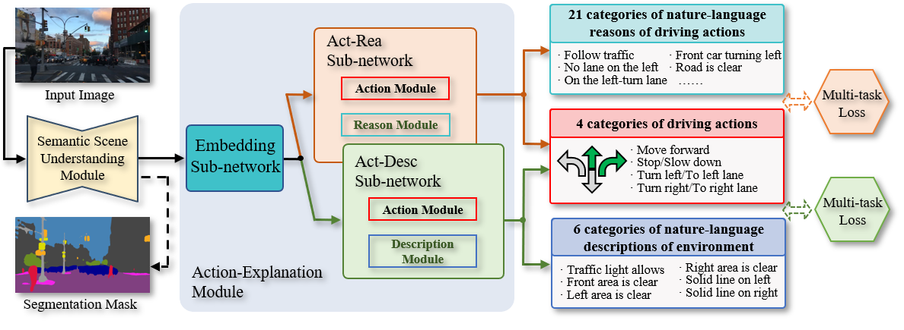

# NLE-DM
The official pytorch implementation of NLE-DM.


## Environment setting：
* Python 3.6 or higher
* Pytorch 1.10 or higher
* torchvision 0.11.1 or higher
* numpy 1.21.3 or higher
* See details in ```requirements.txt```

## Dataset
Download the datasets and then extract it in the file of `Data`
* For BDD_AD dataset, please refer to: https: //
* For BDD100K dataset, please refer to: https://www.bdd100k.com/
* For BDD_OIA dataset, please refer to: https://github.com/Twizwei/bddoia_project/blob/master/README.md

## Pretrained weights：
* Download the pretrained weights and then extract it in the file of `weight`
* The link for pretrained weights is: https: //
* The introduction for each weights is as follows:
```
deeplab_bdd10k: network to predict semantic segmentation on BDD10K
act_exp.pth: network to jointly predict actions and explanations
act_des_resnet50.pth: network to jointly predict actions and descriptions (backbone: ResNet 50)
act_des_resnet101.pth: network to jointly predict actions and descriptions (backbone: ResNet 101)
act_des_mobilenetS.pth: network to jointly predict actions and descriptions (backbone: MobileNetV3_Small)
act_des_mobilenetL.pth: network to jointly predict actions and descriptions (backbone: MobileNetV3_Large)
```


Contact: yx.sun@polyu.edu.hk

Website: https://yuxiangsun.github.io/
